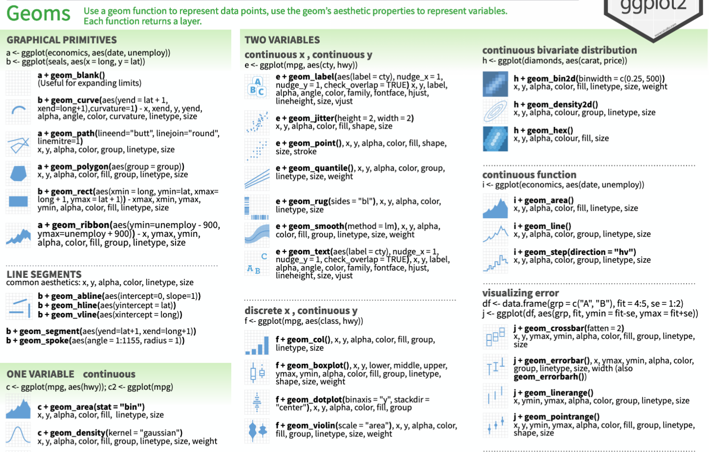
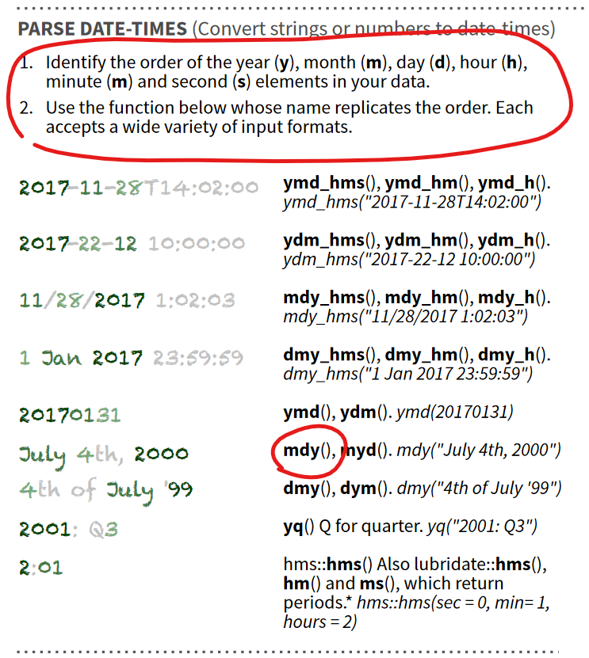

```{r setup, include=FALSE}
knitr::opts_chunk$set(echo = TRUE)
```

```{r packages, include=FALSE}
if(!require(pacman)) {install.packages("pacman")}
if(!require(memer)) {devtools::install_github("sctyner/memer")}
if(!require(emo)) {devtools::install_github("hadley/emo")}
pacman::p_load(tidyverse, lubridate, gapminder, coefplot, memer, emo)
```

## Warm up

Let's do some polling! Go to [pollev.com/kumarr436](http://pollev.com/kumarr436)

## Learning objectives for today

1.  Construct a lesson plan for an R workshop/session
2.  Understand the examples-and-exercises approach to teaching R
3.  Articulate questions about how to teach R workshops/sessions
4.  Identify resources to address those questions

## Outline

- Preparing to teach
- Determining the scope of your lesson
- Building your lesson (nuts-and-bolts)
- Structuring your lesson (what goes after what?)
- Examples and Exercises

# Preparing to teach

## Why should you learn to teach R?

> - Teaching is the best way to learn `r emo::ji("nerd")`
> - Lots of opportunities to teach R workshops/etc at Northwestern `r emo::ji("teacher")`
> - Build your teaching portfolio `r emo::ji("folder")`
> - Training for certain non-academic career paths `r emo::ji("money with wings")`

## Questions to ask yourself

> - What are your **learning objectives** for the course/session/workshop?
> - What are the opportunities and constraints you'll have in your **teaching environment**?
> - How much **background** do your students have? How much do they need?

## Learning objectives

> - Much of this will be determined by context: the students may need specific skills (e.g. regression, data viz) for a class, you may be teaching general-purpose skills for data analysis, etc.
> - I suggest that every R workshop should share two objectives: **Articulate questions about the [technique/method taught]** and **Identify resources to address those questions**.
> - In simpler language: you want students to walk away knowing how to ask for help when they run into problems.

## Teaching environment

> - One-off workshop vs. series 
> - Virtual vs. in-person 
> - Solo teaching vs. group teaching

# Determining the scope of your lesson

## Background knowledge

- What do the students already know? You may be able to answer this from program structure, or through a survey.

- Sometimes students will be coming in with different levels of background knowledge. You can try to address this before the session and/or adjust your teaching accordingly.

- Where can students get background knowledge before the session?

    - Pre-session videos
    - DataQuest
    - `learnr` tutorials

## Do you need to cover the basics? What *are* the basics?

> - Installing R and RStudio
> - Navigating RStudio
> - "code", "comments", "objects"
> - Syntax and data types
> - Data structures
> - Reading and writing files

# Building your lesson

## Building your lesson

> - Befriend `RMarkdown` (and `RProjects`)
> - Consider how to store and share materials: Github, Box folder, something else, none of the above
> - Other types of tools: RStudio Cloud
> - Connect to other course materials, pre-workshop assignments, etc.

# Structuring your lesson

## Where to start

Motivation

- Use the end point as motivation: show them what they will learn!
- Pick some real data that the students are likely to be interested in

Help students feel comfortable

- Remind them that they are learning a skill, which only comes with practice
- Encourage your students to learn from *each other*

## Core content

I usually outline the core content by:

1.  Drafting the end products and breaking down each step.
2.  Looking up existing teaching materials on the same/related topic.

I strongly suggest an **examples and exercises** approach to teaching skills in R. We'll practice this in a moment.

## Building flexibility into your lesson

- Plan for a little bit more material than you can teach
- Provide data files that students can play around with
- For complex skills, give yourself wiggle room to skip over exercises based on timing/interest

## Ending with encouragement

I always like to end with:

1.  Main takeaways
2.  Resources
3.  Reminder that they've just learned to create things!

# Examples and Exercises

## Learning by doing

```{r out.width="45%", echo=FALSE}
meme_get("TwoButtonsAnxiety") %>% 
    meme_text_buttons("Listen to the instructor", "Take notes", size=18)
```

## Learning by doing

Open the RProject file and look in the working directory: you will see an `exercises` subdirectory and an `answers` subdirectory.

The following lesson snippets all use `.R` code files for the exercises. You can also ask students to use `.Rmd`, especially if this is part of a course where you will need to collect assignment submissions.

# Lesson snippets

# Lesson snippet 1: ggplot and the grammar of graphics

## Components of a basic plot

- **data**: a data frame, provided to the `ggplot()` function
- **geometric objects**: the objects/shapes that you want to plot, indicated through one of the many available `geom` functions, such as `geom_point()` or `geom_hist()`
- **aesthetic mapping**: the mapping from the data to the geometric objects, provided in an `aes()` function nested within `ggplot()` or a `geom` function
- connected with the `+` operator

```{r ggplot structure, eval=F}
ggplot(data = <DATA FRAME>) + 
  <GEOM_FUNCTION>(mapping = aes(<VARIABLES>))
```

```{r ggplot structure simple, eval=F}
ggplot(<DATA FRAME>) + 
  <GEOM_FUNCTION>(aes(<VARIABLES>))
```

## Prepare data

```{r}
# Load data
gapminder <- gapminder::gapminder

# Look at the structure of the data. You can use glimpse(), summary(), or head().
glimpse(gapminder)
```

```{r}
# Create a new data frame with only the data for 2007
gapminder07 <- filter(gapminder, year==2007)
```

## A basic scatterplot

```{r}
ggplot(gapminder) + 
    geom_point(aes(x=year, y=pop))
```

## A basic scatterplot

These will produce the same output:

```{r eval=F}
ggplot(gapminder) + 
    geom_point(aes(x=year, y=pop))
```

```{r eval=F}
ggplot(gapminder, aes(x=year, y=pop)) + 
    geom_point()
```

## Add labels to the plot

```{r}
ggplot(gapminder) + 
    geom_point(aes(x=year, y=pop)) + 
    labs(title="Population over time", x="Year", y="Population")
```

## Your turn!

Plot life expectancy as a function of GDP per capita for the year 2007, and add labels.

> - Step 1: Supply the data `gapminder07` to `ggplot()`
> - Step 2: Choose `geom_point()` + Supply `x=gdpPercap` and `y=lifeExp` to `aes()`
> - Step 3: Add `title`, `x`, and `y` in `labs()`

## Your turn!

```{r}
ggplot(gapminder07) + 
    geom_point(aes(x=gdpPercap, y=lifeExp)) + 
    labs(title="Do people in richer countries live longer?", x="GDP per capita", y="Life expectancy")
```

## Choosing geoms

There are may `geom` functions we can choose to generate geometric objects:

{width="596"}

Let's try to add `geom_smooth()` to the previous plot we created.

## Smoothed conditional means

```{r eval=F}
ggplot(gapminder07) + 
    geom_point(aes(x=gdpPercap, y=lifeExp)) + 
    geom_smooth(aes(x=gdpPercap, y=lifeExp)) + 
    labs(title="Do people in richer countries live longer?", x="GDP per capita", y="Life expectancy", subtitle="Gapminder 2007 data")
```

```{r eval=F}
ggplot(gapminder07, aes(x=gdpPercap, y=lifeExp)) + 
    geom_point() + 
    geom_smooth() + 
    labs(title="Do people in richer countries live longer?", x="GDP per capita", y="Life expectancy", subtitle="Gapminder 2007 data")
```

## Smoothed conditional means

```{r}
ggplot(gapminder07, aes(x=gdpPercap, y=lifeExp)) + 
    geom_point() + 
    geom_smooth() + 
    labs(title="Do people in richer countries live longer?", x="GDP per capita", y="Life expectancy", subtitle="Gapminder 2007 data")
```

## Horizontal line

```{r}
ggplot(gapminder07) + 
    geom_point(aes(x=gdpPercap, y=lifeExp)) + 
    geom_hline(aes(yintercept=mean(lifeExp))) + 
    labs(title="Do people in richer countries live longer?", x="GDP per capita", y="Life expectancy", subtitle="Gapminder 2007 data")
```

## Your turn!

Plot the **life expectancy** of each **continent** in 2007.

Look at the [ggplot cheatsheet](https://raw.githubusercontent.com/rstudio/cheatsheets/master/data-visualization-2.1.pdf) and decide which kind of geom to use.

> - Step 1: Supply `gapminder07` to `ggplot()`
> - Step 2: Choose a `geom` (e.g. `geom_boxplot()`) and supply appropriate aesthetics in nested `aes()` (e.g. `x=continent, y=lifeExp`)
> - Step 3: Add some labels in `labs()`

## Life expectancy in each continent

```{r}
ggplot(gapminder07) + 
    geom_boxplot(aes(x=continent, y=lifeExp)) + 
    labs(title="Distribution of life expectancy", x="Continent", y="Distribution")
```

## Life expectancy in each continent

```{r}
ggplot(gapminder07) + 
    geom_col(aes(x=continent, y=lifeExp)) + 
    labs(title="Distribution of life expectancy", x="Continent", y="Distribution")
```

## Grouping variables

You can think of the `continent` or `year` variables as **grouping variables**: they place each observation in one of several groups.

We can represent the groups through aesthetic mapping or facets rather than along one of the axes.

## Grouping by color

```{r}
ggplot(gapminder) + 
    geom_point(aes(x=gdpPercap, y=lifeExp, col=year)) + 
    labs(title="Do people in richer countries live longer?", x="GDP per capita", y="Life expectancy")
```

## Grouping by facet

```{r, warning=FALSE}
ggplot(gapminder, aes(x=gdpPercap, y=lifeExp)) + 
    geom_point() + 
    geom_smooth() + 
    facet_wrap(~year) + 
    labs(title="Do people in richer countries live longer?", x="GDP per capita", y="Life expectancy")
```

## Grouping by facet ... scales="free"

Try adding the argument `scales="free"` to the `facet_wrap()` layer.

## Grouping by facet ... scales="free"

```{r, warning=FALSE}
ggplot(gapminder, aes(x=gdpPercap, y=lifeExp)) + 
    geom_point() + 
    geom_smooth() + 
    facet_wrap(~year, scales="free") + 
    labs(title="Do people in richer countries live longer?", x="GDP per capita", y="Life expectancy")
```

## Your turn!

Visualize **life expectancy** by continent **in 2007** again. This time, group continents by color or facet.

## Grouping by colors

```{r}
ggplot(gapminder07, aes(x=gdpPercap, y=lifeExp, 
                        col=continent, size=pop)) + 
    geom_point() + 
    labs(title="Life expectancy as a function of GDP per capita, by continent", x="GDP per capita", y="Life expectancy")
```

## Grouping by facet

```{r}
ggplot(gapminder07, aes(x=lifeExp)) + 
    geom_density() + 
    facet_wrap(~continent, scales="free") + 
    labs(title="Life expectancy as a function of GDP per capita, by continent", x="GDP per capita", y="Life expectancy")
```

## Cumulative exercise

Choose your own adventure!

Create a plot that includes **two geoms** and **facets**

# Lesson snippet 2: working with dates

## Prepare libraries and data

```{r}
# Load tidyverse and lubridate
library(tidyverse)
library(lubridate)

# Import vaccine data
vaccines <- read_csv("data/chicago_vaccines_daily.csv")
```

```{r}
# Let's glimpse the data
glimpse(vaccines)
```

## Working with dates

In your exercise file, check the class of the date variable.

## Working with dates

Check the class of the date variable: 

```{r}
class(vaccines$date)
```

This is just a character string. And it's not even ordered correctly!

```{r}
head(vaccines$date)
```

## Working with dates

It looks like `as_date()` might be a helpful function from `lubridate`. But what happens when we use it?

```{r}
as_date(vaccines$date)
```

Whoops! Let's turn to the `lubridate` [cheatsheet](https://raw.githubusercontent.com/rstudio/cheatsheets/master/lubridate.pdf) for help. What function should we use? 

## Converting dates



## Converting dates

We can use the tailored `mdy()` function:

```{r}
mdy(vaccines$date) %>% head()
```
Or we can speficy the format of the values in the character string using the `format=` argument in `as_date()`. See the help file for `strptime()` for how to define formats.

```{r}
as_date(vaccines$date, format="%m/%d/%y") %>% head()
```

## Converting dates

```{r}
# Replace the date variable in the dataset with the converted version
vaccines$date <- mdy(vaccines$date)

# Check the class of our converted variable
class(vaccines$date)
```

## Utility of the Date format

```{r}
ggplot(vaccines, aes(x=date, y=doses)) + geom_col() 
```

## Converting dates

Now, let's try to convert the `date` variable, which is in `Date` class, into a numeric value for month. 

## Converting dates

```{r}
# Create a new variable for month. Refer to the cheatsheet for guidance.
vaccines$month <- month(vaccines$date)

# Repeat the plot, using month as the x-axis
ggplot(vaccines, aes(x=month, y=doses)) + geom_col()
```

## Converting dates 

How about if we want to get the *day of the week*? Identify the right function using the `lubridate` cheatsheet. Check the help file to see if there are any useful arguments. 

```{r}
# Create a new variable for day of the week, with label=TRUE
vaccines$wday <- wday(vaccines$date, label=TRUE)

# Repeat the plot, using day of the week as the x-axis
ggplot(vaccines, aes(x=wday, y=doses)) + geom_col()
```

## Working with dates

Bonus exercise if time permits: Can you calculate the number of days it took for Chicago to fully vaccinate 1 million people?

<small>Hint: You may need to ue the function `cumsum()`</small>

# Lesson snippet 3: regression and coefplot

## [under construction -- answers/exercise1_answers.R shows what will be covered]

# Wrapping up

## Takeaways

1.  Lesson planning is really important: Develop learning objectives. Assess what your students already know + what they need.
2.  Use the tools that R provides: `RMarkdown`, `RProjects`, and `RStudio` itself.
3.  Construct your lessons around examples and exercises, so that students practice writing code *during* the session.
4.  Lean on the broad community of R users and social scientists. You almost never have to start from scratch.

## Resources

Examples from NU:

- [NUIT Research Computing Services workshops](https://github.com/nuitrcs)
- [Masters of Science in Analytics boot camps](https://github.com/msia/bootcamp-2019)
- [Amanda d'Urso's tutorials and workshops](https://sites.northwestern.edu/asdurso/r/)

Other resources:

- [Library of free learning resources](https://sites.northwestern.edu/researchcomputing/category/learning-resources/), from NUIT RCS
- [Compilation of resources often used by social scientists](https://efarristcu.medium.com/teaching-myself-r-c03c52361bed), from Emily Farris
- [`learnr` interactive tutorials](https://rstudio.github.io/learnr/), from RStudio
- [Dataquest](https://www.it.northwestern.edu/research/campus-events/data-camp.html) (coursework license available from NUIT)

Take it to the next level (suggestions from Christina Maimone):

- ["Teaching Tech Together"](https://teachtogether.tech/) + [Carpentries Instructor Training](https://carpentries.github.io/instructor-training/)

## You can do it!


